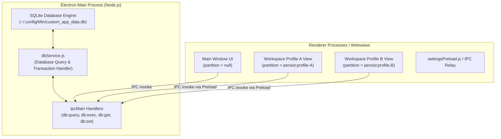

# Plan Architecture: Centralized SQLite Storage System for Custom Features

## 1. Executive Summary
This document outlines the architectural plan to transition custom browser features (Workspace Profiles, AI Agent configurations & history, Design data, Workspace Snapshots, and Tab Activity Logs) from fragmented web storage (`localStorage` inside Electron session partitions) to a **Centralized SQLite Database** managed by the **Electron Main Process**.

By introducing a Single Source of Truth at the Node.js main process level, all custom data becomes **100% immune to Electron's session partition isolation (`persist:profile-xxx`)**, highly performant, and resistant to data corruption.

---

## 2. Problem Statement & Motivation

### Current Issues:
1. **Session Partition Isolation**:
   Webviews inside workspace profiles run in isolated partitions (e.g. `persist:profile-12345`). Direct access to `localStorage` or IndexedDB inside webviews isolates data to that specific workspace partition, causing data missing/disappearing errors when opened across different tabs or UI windows.
2. **Scalability Limitations of LocalStorage & Atomically Written JSON**:
   Large persistent data structures (such as workspace snapshots, design documents, and activity logs) cause severe I/O bottlenecks and risk corruption when read/written atomically as JSON files.

### Solution:
A **Centralized SQLite Database Service (`dbService.js`)** running in the Main Process. All webviews and UI pages communicate with this service via Electron IPC handlers.

---

## 3. System Architecture Diagram



---

## 4. Database Schema Design

The SQLite database file will be created automatically at `app.getPath('userData') + '/custom_app_data.db'`.

### Table 1: `user_preferences`
*Stores key-value pairs for global custom settings, AI agent keys, and custom feature toggles.*
```sql
CREATE TABLE IF NOT EXISTS user_preferences (
    key TEXT PRIMARY KEY,
    value TEXT NOT NULL,
    updated_at INTEGER NOT NULL
);
```

### Table 2: `workspace_profiles`
*Replaces `localStorage.getItem('workspaceProfiles')` to centralize profile definitions.*
```sql
CREATE TABLE IF NOT EXISTS workspace_profiles (
    id TEXT PRIMARY KEY,
    name TEXT NOT NULL,
    color TEXT,
    created_at INTEGER NOT NULL
);
```

### Table 3: `workspace_snapshots`
*Stores full snapshot histories and archives for workspaces.*
```sql
CREATE TABLE IF NOT EXISTS workspace_snapshots (
    id TEXT PRIMARY KEY,
    workspace_id TEXT NOT NULL,
    title TEXT,
    snapshot_data TEXT NOT NULL, -- JSON formatted workspace state
    created_at INTEGER NOT NULL
);
CREATE INDEX IF NOT EXISTS idx_snapshots_workspace ON workspace_snapshots(workspace_id);
```

### Table 4: `design_documents`
*Stores design data, layouts, and canvas/node documents.*
```sql
CREATE TABLE IF NOT EXISTS design_documents (
    id TEXT PRIMARY KEY,
    workspace_id TEXT,
    title TEXT NOT NULL,
    content TEXT NOT NULL, -- JSON payload of design structure
    created_at INTEGER NOT NULL,
    updated_at INTEGER NOT NULL
);
CREATE INDEX IF NOT EXISTS idx_designs_workspace ON design_documents(workspace_id);
```

### Table 5: `tab_activities`
*Stores activity metrics, visited URLs, and interaction history per tab/workspace.*
```sql
CREATE TABLE IF NOT EXISTS tab_activities (
    id INTEGER PRIMARY KEY AUTOINCREMENT,
    workspace_id TEXT,
    tab_id TEXT,
    url TEXT NOT NULL,
    title TEXT,
    metadata TEXT, -- JSON formatted metadata
    timestamp INTEGER NOT NULL
);
CREATE INDEX IF NOT EXISTS idx_activities_timestamp ON tab_activities(timestamp);
CREATE INDEX IF NOT EXISTS idx_activities_workspace ON tab_activities(workspace_id);
```

---

## 5. Phased Implementation Roadmap

### Phase 1: Main Process SQLite Integration & Service Layer
- Add SQLite engine integration (using `better-sqlite3` or `sql.js` / Node SQLite binding).
- Create `main/dbService.js` to manage connection, migrations, and query execution.
- Register IPC handlers in `main/main.js`:
  - `ipcMain.handle('db:get', ...)`
  - `ipcMain.handle('db:set', ...)`
  - `ipcMain.handle('db:query', ...)`

### Phase 2: Migration of Existing Custom Features
- Migrate `workspaceProfiles` storage from `localStorage` to SQLite `workspace_profiles` table.
- Migrate `taskRestoreData` / `workspaceRestoreData` to SQLite `workspace_snapshots` table.
- Expose unified JavaScript helper `js/util/customDataStore.js` for renderer access.

### Phase 3: Integration of New Custom Features
- Implement Design Data APIs (`saveDesign`, `getDesign`, `listDesigns`).
- Implement Workspace Snapshot Archive APIs (`createSnapshot`, `restoreSnapshot`, `deleteSnapshot`).
- Implement Tab Activity Loggers (`logActivity`, `getActivitiesByWorkspace`).

---

## 6. Key Benefits & Verification Criteria

| Criteria | Before (Web Storage) | After (Centralized SQLite) |
| :--- | :--- | :--- |
| **Partition Isolation** | Data isolated inside `persist:profile-xxx` | **100% Shared & Centralized** across all partitions |
| **Performance** | High memory & CPU cost for large JSON files | **Fast O(1) / indexed O(log N)** read/write operations |
| **Data Integrity** | Prone to corruption on crash during write | **ACID Compliant** (WAL mode enabled) |
| **Search & Query** | Manual array filtering in JavaScript | **SQL Queries & Indexing** |
